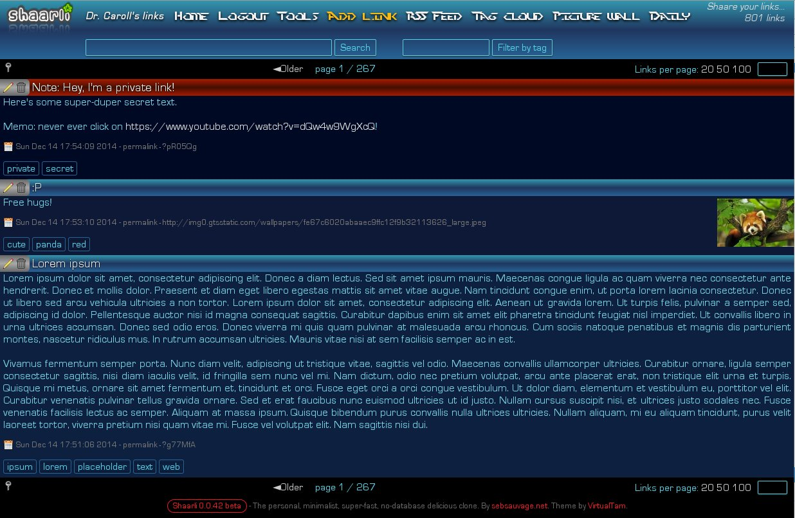

##Perfect Daark
Joaana Daark's favourite Shaarli flavour!

###Installation & requirements
Perfect Daark is based on the default theme, and overrides some of its CSS rules.

To install it:
* copy `user.css` in your `shaarli/inc` directory,
* download the two extra fonts used by the theme, to `shaarli/inc`:
 * [Perfect Dark](http://www.dafont.com/perfect-dark.font) (pdark.ttf),
 * [Eurostile](http://www.ffonts.net/Eurostile.font.download) (eurostile.ttf),
 * check the downloaded filenames, else the fonts won't be loaded!